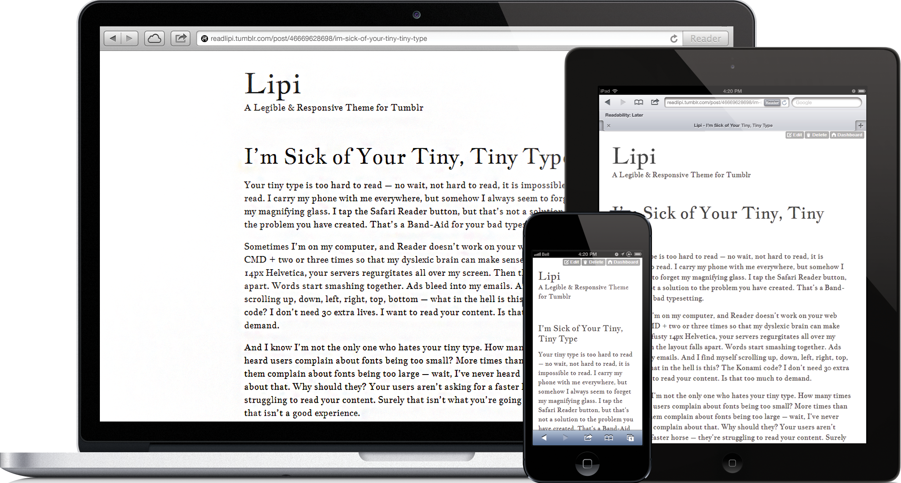

Lipi
======

A Responsive and Legible Theme for Tumblr, utilizing Google Web Fonts

### Legible
Don't bow over. Sit back and relish.

### Responsive
Content is device agnostic. Your blog should be too.

### Minimal!!
Just what you need. No more, and certainly No less.

### Highly Customizable
Use any Google Web Font. Defaults to Gentium Book.

[upamanyu.in/lipi](http://upamanyu.in/lipi)

[View on Tumblr Themes](http://www.tumblr.com/theme/37077)

## How to switch Google Web Fonts in Tumblr

1. Choose a font from [Google Web Fonts](http://www.google.com/webfonts)

2. Go to your blog and click Customize

3. In the *GoogleWebFont* field, type or paste in the name of the font – e.g. *Gentium Book Basic*

4. In the *GoogleWebFontURL* field, type or paste in the name as it appears in Google's code – e.g. *Gentium+Book+Basic*

5. Click *Save* 